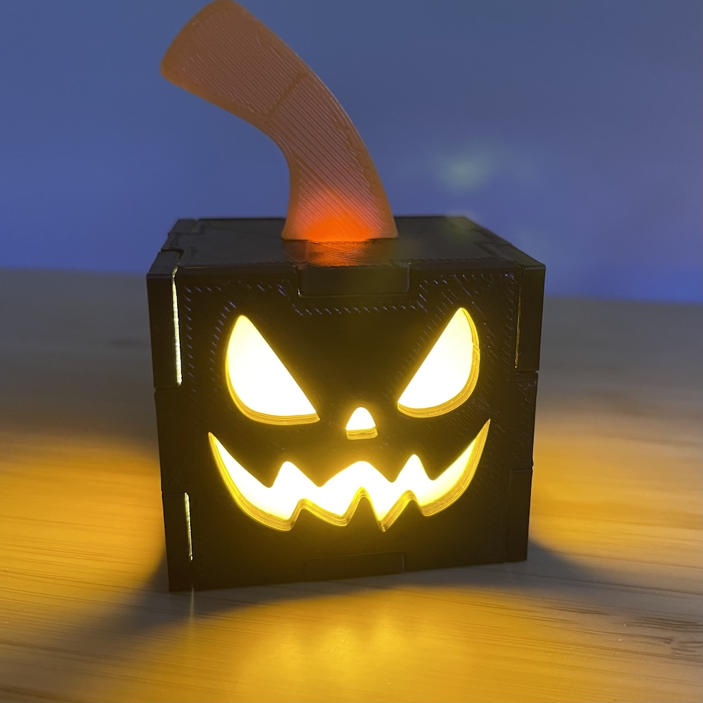
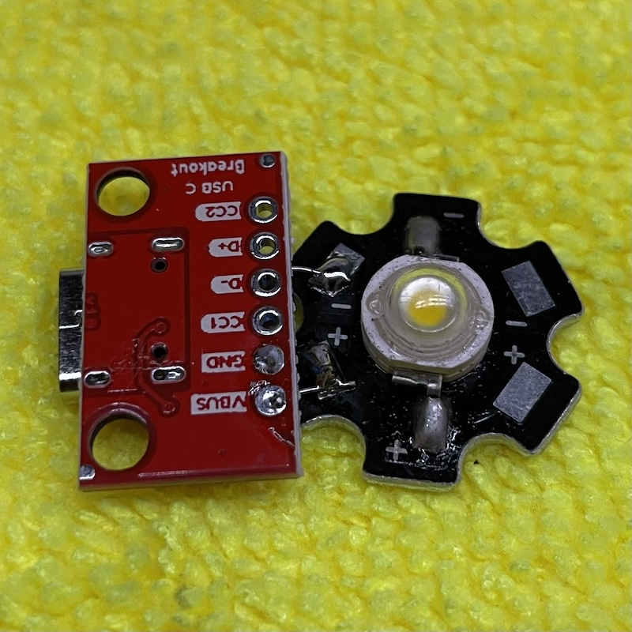
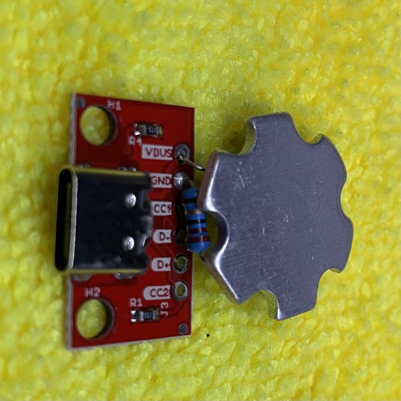
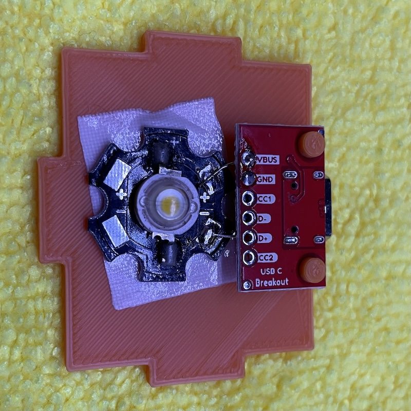
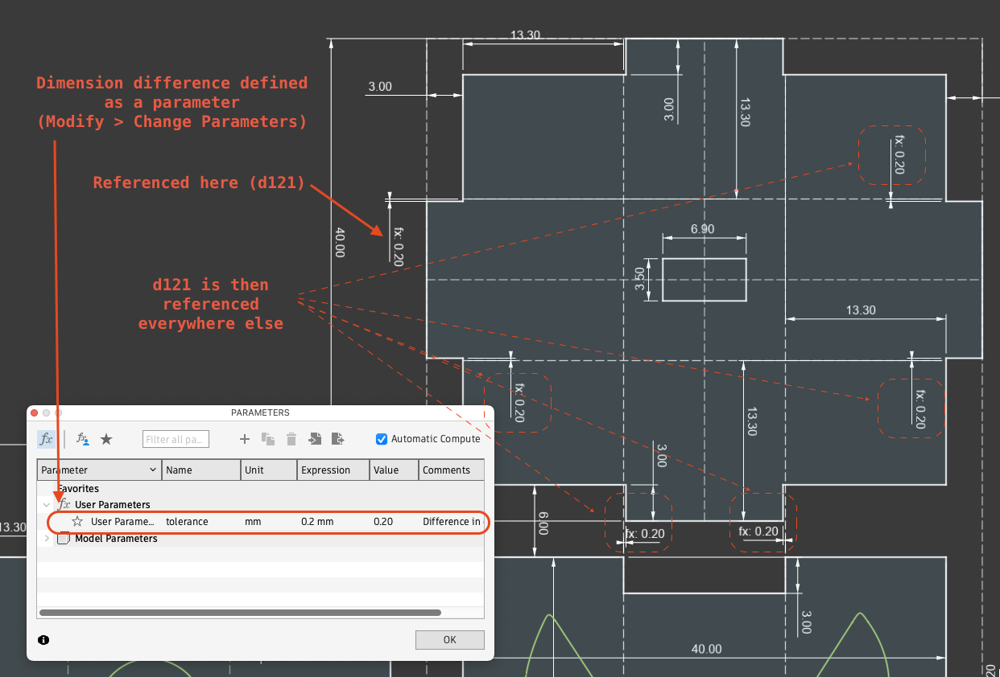

# Jack-O-Lantern (3d printed, powered by USB)

## Parts:

* COB [LED light](https://www.aliexpress.us/item/3256807134620275.html?spm=a2g0o.order_list.order_list_main.80.6a891802asZcih&gatewayAdapt=glo2usa)
* 22 ohm resistor (or similar value)
* USB-C [breakout board](https://www.amazon.com/dp/B0F2S1K5X8?ref=ppx_yo2ov_dt_b_fed_asin_title)
* Orange vellum paper (optional)
* Double sides tape, super glue, paper glue, hot glue and glue gun
* Soldering iron and tin
* 3D printer

## Steps

There isn't much to it once you have 3d printed everything. 

0. 3D print all the pieces

1. Solder the resister, USB breakout board, and the LED together

2. Tape the LED down to the bottom piece and fit the USB C breakout board to the posts. Optionally, drip a couple of drops of hot glue on the posts.

3. Super glue the stem and the lid together. Hot glue doesn't work as well. B7000 works fine too.

## Notes:
* The LED I have is rated 1W at 3V. I tried to power it with 5V and it got too hot too soon. So I added a 22 ohm resistor. The voltage is down to just about 3V and the current is about 90 mA. Not quite 1W but bright enough and the LED stays cool.
* I used a USB C breakout board as the power suppy. It has a couple of 5.1K resistors to trigger 5V so that it'd work with a PD charger in addition to basic dumb chargers. If you use a dumb USB C breakout board, it'll only work with a dumb charger. All USB-A chargers are dumb.
* The cube is printed in 7 pieces (one for the stem) and friction fitted together. If you don't want to fine tune the dimensions, make the gap big enough and use some hot glue.
* For the LED to shine through the patterns, I originally had them completely cut out, and it was terrible. Then I carve it down to 0.2mm, just one layer. It worked perfectly for orange filament, but not black. So I decided to cur the patterns out and laminate a piece of orange paper from inside.
* Since all pieces are friction fitted together, I had to adjust the dimensions of the tabs by trial and error. Eventually, a size difference of 0.6mm between the tabs and the notches worked well for my black filament. However, it was just a tad too big for my orange filament. So I parameterized it in Fusion 360, so that I can simply change one value when switching filaments. It turned out 0.4mm (0.2mm on either side) works well for this particular filament.

## Downloads and gallery
* Find under this folder the `.f3d` file that you can open in fusion 360.
* Find under [`stils`](./stls/) for STLs. I created them for *my* orange and black filaments respectively. I.e. with tolerance set to 0.3 for black and 0.2 for orange. This may not work for your filament. Also, the black STLs have the patterns hollowed out, but not orange.
* [Here's](./gallery/) the gallery